In this part we will guide you through the basic functions of Langtail and help you leverage all its features, enabling you to craft and test your prompts with ease.

For most users, we recommend starting with the [**Getting Started**](https://langtail.com/docs/tutorials/getting-started). This will walk you through creating an account, setting up your first project, and familiarizing yourself with the Langtail interface and key concepts.

From there, you can explore the other examples based on your interests and needs:

- [**Playground**](/tutorials/playground/overview): Learn how to create, manage, and enhance your prompts using Langtail's Playground.
- [**Tests**](/tutorials/tests/overview): Ensure your language models perform reliably and consistently by creating and running tests.
- [**Deployments**](/tutorials/deployments/overview): Take your prompts to production by publishing them as API endpoints.
- [**Logs and Metrics**](/tutorials/logs-and-metrics/overview): Gain valuable insights into your deployed prompts' performance and usage.

```mermaid
flowchart TD
    Langtail((("🚀 Langtail")))
    Playground[("🎮 Playground")]
    Tests[("🧪 Tests")]
    Deployments[("🚀 Deployments")]
    LogsMetrics[("📊 Logs and Metrics")]

    Langtail --> Playground
    Langtail --> Tests
    Langtail --> Deployments
    Langtail --> LogsMetrics

    Playground --> Create("✏️ Create")
    Playground --> Manage("🔧 Manage")
    Playground --> Enhance("🔼 Enhance")

    Tests --> CreateTests("✏️ Create")
    Tests --> RunTests("▶️ Run")

    Deployments --> Publish("📤 Publish")
    Deployments --> API("🔌 API Endpoints")

    LogsMetrics --> Performance("📈 Performance")
    LogsMetrics --> Usage("📉 Usage")

    classDef default fill:#f9f7f7,stroke:#112d4e,stroke-width:2px,color:#112d4e;
    classDef highlight fill:#3f72af,stroke:#112d4e,stroke-width:4px,color:#f9f7f7;
    classDef subfeature fill:#dbe2ef,stroke:#112d4e,stroke-width:2px,color:#112d4e;
    
    class Langtail highlight;
    class Playground,Tests,Deployments,LogsMetrics default;
    class Create,Manage,Enhance,CreateTests,RunTests,Publish,API,Performance,Usage subfeature;
```

For advanced users or those looking directly for API references, check out the [**References**](/api-reference/endpoint/invoke-deployed-prompt) section.