### Assistants and Threads

In Langtail, an Assistant is a stateful entity that manages conversation history and context, as opposed to a Prompt, which is stateless. Assistants automatically handle message management, eliminating the need for developers to handle message saving on their end, as is required when using Prompts.

#### Distinction from OpenAI Assistants

Langtail's Assistant API is distinct from the OpenAI Assistants API. While Langtail allows you to import and use your OpenAI Assistants, it does not directly utilize the OpenAI Assistants API. Unlike OpenAI, Langtail does not currently support uploading files to be used as a knowledge base for the Assistant. However, a key advantage of Langtail Assistants is that they are not tied to a specific model, enabling their use with models from various providers, such as Anthropic or Llama.

<Note>
Langtail Assistants can be utilized in tests, deployed as API endpoints, and integrated with variables and tools, similar to Prompts. Additionally, Langtail supports Hosted Functions, allowing tools to directly call external APIs within the platform.
</Note>

#### Benefits of Assistants

- Memory management is handled by Langtail, eliminating the need for developers to manage it.
- Threads (conversation histories) are saved within Langtail, providing improved observability and traceability.
- Assistants can be used in tests, deployed as API endpoints, and integrated with variables and tools, similar to Prompts.

#### Memory Management Strategies

A crucial aspect of Assistants is how their memory is managed. Currently, the default memory management strategy is a buffer of all messages, which can be problematic when there are many messages, as it may exceed the context limit of the model.

In the near future, Langtail will introduce additional memory management strategies, such as:

- Retaining the last X messages
- Retaining the last X tokens
- Generating a summary of previous conversations
- Combinations of the above strategies

```mermaid
flowchart LR
    A[("🤖 Assistant")]
    T1["🧵 Thread 1"]
    T2["🧵 Thread 2"]
    T3["🧵 Thread 3"]
    M1["💬 Message 1"]
    M2["💬 Message 2"]
    M3["💬 Message 3"]
    M4["💬 Message 4"]
    M5["💬 Message 5"]
    MM{"🧠 Memory<br>Management"}

    A --> T1
    A --> T2
    A --> T3
    T1 --> M1
    T1 --> M2
    T2 --> M3
    T3 --> M4
    T3 --> M5
    
    MM -.-> A
    MM -.-> T1
    MM -.-> T2
    MM -.-> T3
    
    classDef assistant fill:#4CAF50,stroke:#45a049,stroke-width:2px,color:white;
    classDef thread fill:#2196F3,stroke:#1e88e5,stroke-width:2px,color:white;
    classDef message fill:#FFC107,stroke:#ffa000,stroke-width:2px,color:#333;
    classDef memory fill:#9C27B0,stroke:#8e24aa,stroke-width:2px,color:white;

    class A assistant;
    class T1,T2,T3 thread;
    class M1,M2,M3,M4,M5 message;
    class MM memory;
```

#### Configuring an Assistant

Configuring an Assistant is similar to configuring a Prompt [link to Prompt guide](/introduction/getting-started). The primary distinction is that you can also import an Assistant from OpenAI if you have already added your OpenAI API key in the settings.

<video
      controls
      className="w-full aspect-video"
      src="/images/playground/assistants/assistants.mp4"
    ></video>

#### Threads

A Thread is a record of a single conversation with an Assistant. When a message is sent to an Assistant, a new Thread is created. Within Langtail, you can view all Threads created by your Assistants, filter them by User ID, Assistant, and creation time.

